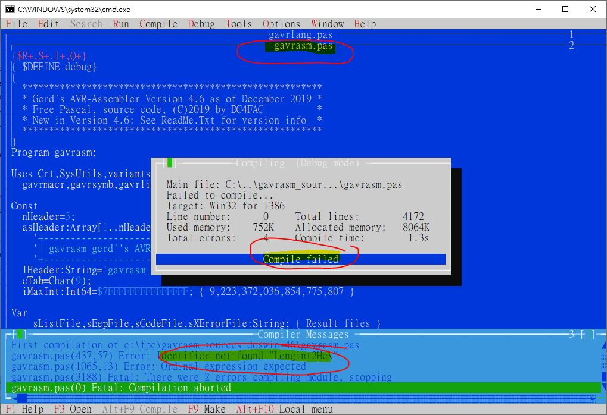
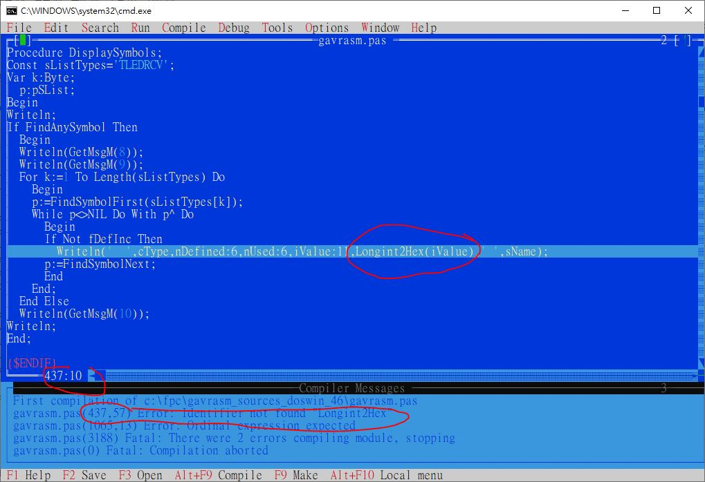

# gavrasm
Originator and credits, http://www.avr-asm-tutorial.net/gavrasm/index_en.html#source, it was down, load my backup


local archive E:\backup\2017-07-21 H trip\DIY\2017-09-06 AVR tiny bootloader assembler   

### how to compile
download Free Pascal compiler (fpc, see http://www.freepascal.org).  
install FPC, mine is C:\FPC\3.2.2   
invoke FPC in win10, nothing showing up,   
crated batch file run_fp.bat, save to C:\FPC\3.2.2\bin\i386-win32, double click & run FPC IDE explicitly,  
in FPC IDE menu, Compile -> Target -> Win32 for i386  

download gavrasm_sources_doswin_45.zip source code, unzip C:\FPC\gavrasm_sources_doswin_45 (or version 4.5)  
copy your desired language file gavrlang_xx.pas, rename it to gavrlang.pas   
compile or build or make gavrlang.pas, no error  
compile or build or make gavrasm.pas, error as following  

  


failed, gavrasm.pas, V3.6 ok, Ver4.5 & Ver4.6
line 437 Longint2Hex, error 
```
        Writeln('  ',cType,nDefined:6,nUsed:6,iValue:11,Longint2Hex(iValue),' ',sName);
```

```
  C:\FPC\gavrasm_sources_doswin_46\gavrasm.pas （2 個結果）
	行號  437:         Writeln('  ',cType,nDefined:6,nUsed:6,iValue:11,Longint2Hex(iValue),' ',sName);
	行號  512:       Writeln(fl,'        ',Longint2HexN(6,ListGetAddressLongInt+1),'   ',LongInt2HexN(4,w2));
```

refer to gavrasm.pas, there is function LongInt2HexN  
change line 437, add 1 line,
```
        Writeln('  ',cType,nDefined:6,nUsed:6,iValue:11, LongInt2HexN(nUsed,iValue),' ',sName);
```

change line 512, add 1 line to,  
```
    {Writeln(fl,ListGetLineAndAddress,'  ',Longint2HexN(4,w1),'  ',Copy(cl.sLine,cl.pInst,255));}
    Writeln(fl,ListGetLineAndAddress,'  ', LongInt2HexN(4,w1),'  ',Copy(cl.sLine,cl.pInst,255));
```    

compile or build or make gavrasm.pas again,  
gavrasm.exe will be produced  

V4.5 ok, V4.6 still another bug ??  
  


### testing avrasm2 or gavrasm  
archive E:\2019-11-11_H_trip\DIY\2024-06-06 2N5484\twoMHz_square  
[asm.bat](asm.bat), build hex by uses gavrasm or avrasm2.exe, then uses usbtiny to burn hex to arduino nano/uno, chip 328 or 168  
[twoMHz_square_wave_asm.asm](twoMHz_square_wave_asm.asm), asm source code for testing  
IO waveform of chip 328 or 168, every 8bit rolling getting stretched, do not understnad why was that.   
[why_every_8_bit_rotation_prolonged_2.JPG](why_every_8_bit_rotation_prolonged_2.JPG)


### related stuff
https://github.com/xiaolaba/Free-Pascal-UTF8-supported  
https://github.com/xiaolaba/Free-Pascal-Win10-non-US-PC  
https://github.com/xiaolaba/AVR_328p_168p_8bit_rotation_prolonged_a_little  
https://github.com/xiaolaba/Arduino_Cpp_call_asm_function  
